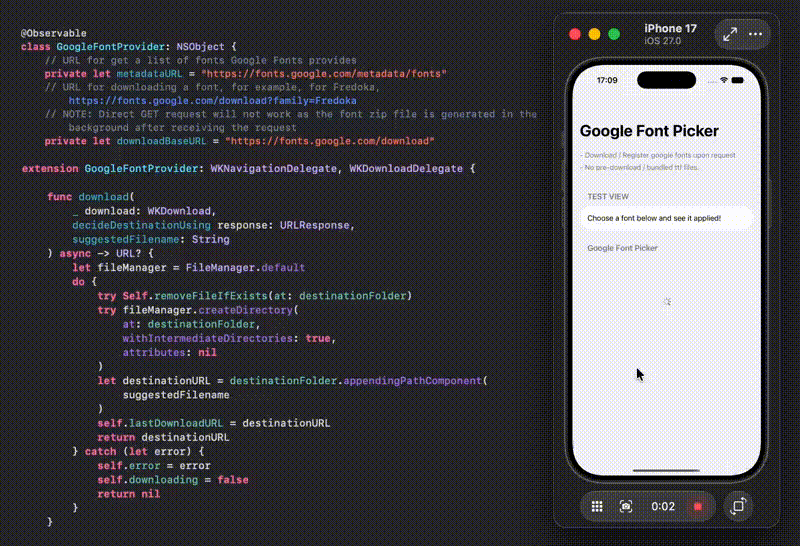

# SwiftUI_GoogleFontProviderPicker
A demo of downloading and using Google Font On the Run Time, upon user request.

For more details, please refer to my blog [SwiftUI: Download and Use Google Font On the Run Time]()

